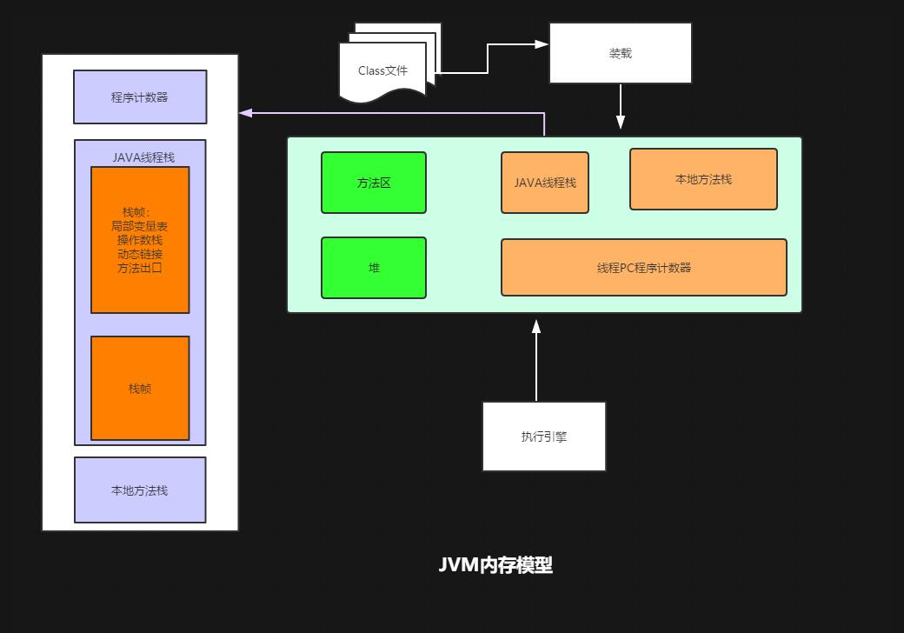
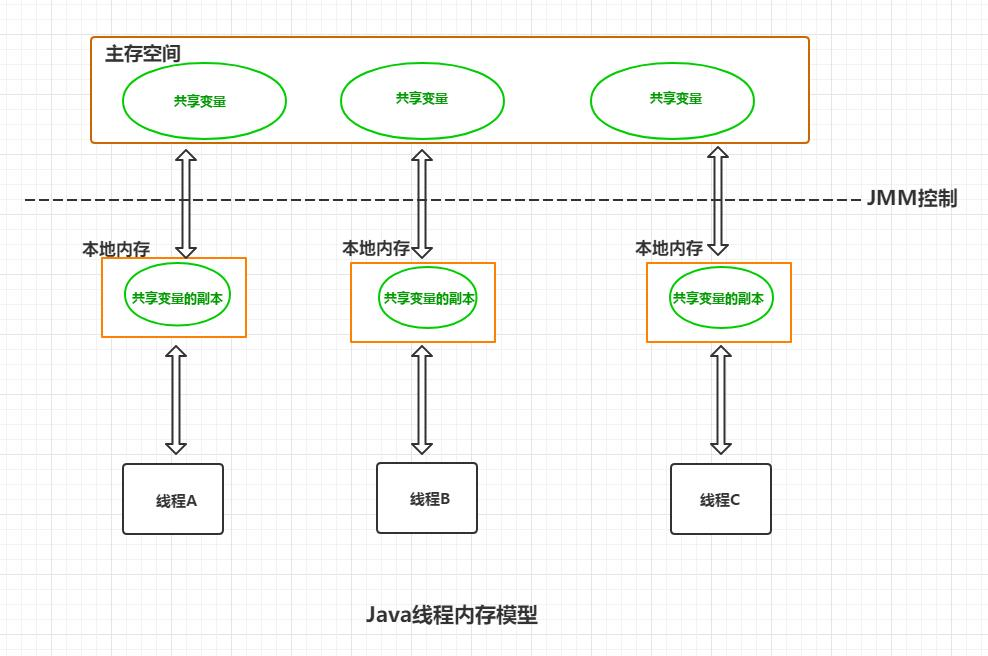

# fuckjava-thread-concurrency  [](https://travis-ci.com/Byron4j/fuckjava-thread-concurrency) 

😨 关于 Java 线程、并发的一些问题

## 👉 👉 为何要编写这么一个小项目

- Java 多线程以及并发是中高级程序猿🙉 🙉必备技能
- 多线程、并发程序难以调试，如果不时常梳理，想当然的写代码，在线上可能会发生👿“幽灵事件”

--------------------------------------------------------------------------------

- ✨[```Volitale```关键字与Java线程内存模型](#Volitale关键字与Java线程内存模型)
    - [Demo演示](#Demo演示)
    - [概念分析](#概念分析)
    - [运行实例](#运行实例)


--------------------------------------------------------------------------------

## ✨```Volitale```关键字与Java线程内存模型

### Demo演示

[VolatileKeyDemo](https://github.com/Byron4j/fuckjava-thread-concurrency/blob/master/src/main/java/org/byron4j/fuckjavathreadconcurrency/volatiletest/VolatileKeyDemo.java)

### 概念分析

  ```Volitale``` 关键字用于表示变量的线程可见性。在Java内存模型(JMM)中，线程包含3个主要部分：线程栈、本地方法栈、PC程序计数器。类的实例对象则存储与堆中。多个线程共享方法区和堆空间。
而在线程模型中，变量真实值存储在主存中，各个线程维护一个该共享变量的副本，操作的是自身的副本值。所以线程A在自身的本地存储空间中操作共享变量时，其它的线程并不感知。

>在编写单例模式时，我们需要使用volatile关键字，因为volatile关键字可以禁止JIT进行指令重排序，指令重排序时可能导致初始化时某些线程获取到的单例为null。

  长久以来，```volitale``` 关键字文档性比较差，理解性也不好，也很少使用，但是在有些情况却又很好使用。
  
 ```volitale``` 关键字本质上来讲，是标明被修饰的变量将可能被多个线程修改。  
 如果定义一个变量为 ```volitale``` 修饰，则表明：
    - 该变量不会被线程本地空间缓存，而是线程直接访问主存空间中的值
    - 访问该变量有点像被包含在```synchronized```块中。
 ```volitale``` 虽然类似```synchronized```但是二者并不一样，volitale 并不包含对变量加锁。
 
  ```synchronized``` 和 ```volatile``` 对比：

|特点|Synchronized|Volatile|  
|----|----|----|
|变量类型|Object|Object或者原始类型|  
|是否允许为null|No|Yes|
|是否可以作为程序快|Yes|No|
|所有缓存变量在访问时是同步的吗？|Yes|从Java5开始|
|什么时候发生同步？|当明确进入或退出Synchronized块时|任何访问变量时|
|可以将多个操作组合成原子操作吗？|Yes|Java5以后 Atomic get-set 是可以的|


>**注意事项**
>
>- 因为volitale不会持有锁，所以如果要进行读+写，是不合适的。因为读到后，其它线程可能已经修改了值，这时候再去写可能不是期望的结果
>
>- 对于final的变量，volitale是不必要的
>
>- 单线程程序，volitale是不必要的
>
>- volitale 不适合复杂的操作，最好使用synchronization或者其它lock类

- Java内存模型



- Java线程内存模型



### 运行实例

运行 [VolatileKeyDemo.java](https://github.com/Byron4j/fuckjava-thread-concurrency/blob/master/src/main/java/org/byron4j/fuckjavathreadconcurrency/volatiletest/VolatileKeyDemo.java)

```java
/**
 * volatile 关键字用法
 * stop 如果不是 volatile 修饰，则thread启动后，看到的是自己线程栈的变量值false，陷入死循环；
 * 如果被 volatile 修饰，则 stop 变量是线程可见的，stop 设置为true后，thread 会退出 while 循环
 */
```


参考资料:

- [```The volatile keyword in Java```](https://www.javamex.com/tutorials/synchronization_volatile.shtml)
- [正确使用 Volatile 变量](https://www.ibm.com/developerworks/cn/java/j-jtp06197.html)

