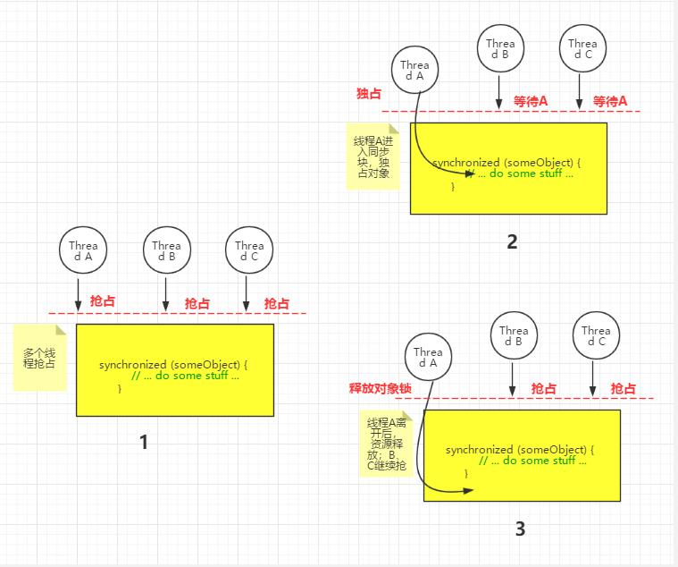

--------------------------------------------------------------------------------


## ✨ Java5之前的同步与并发处理


### 线程间通信方式

-  ```synchronized``` 块
- ```wait()/notify()```
- 

### ```synchronized``` 关键字

```synchronized``` 关键字在java中有2个功能：
- ```synchronized``` 包含的代码块同一时间只能有一个线程进入访问
- 控制了线程间的数据```可见性```

关于多线程抢占同步资源的描述见下图：



#### Demo演示

示例一：

```java
private static int count = 0;


public static void main(String[] args){
    for(int i=1; i <= 1000; i++){
        Utils.executorService.execute(new Runnable() {
            @Override
            public void run() {
                count++;
            }
        });
    }

    Thread.sleep(2000);  // 2秒后输出count的值
    System.out.println("count: " + count);
}
```

这个程序输出正常是count的值最后小于1000的，因为多线程环境下，在某一时刻，线程A、B拿到的值都可能是100，A加一操作后为101，线程B使用其本地变量100加一还是101。

示例二（同步代码块控制多线程访问）：

```java
private static  int count = 0;
public static  void increment() {
    synchronized (SynCounter.class) {
        count++;
    }
}
public static  int getCount() {
    synchronized (SynCounter.class) {
        return count;
    }
}

public static void main(String[] args) throws InterruptedException {
    for(int i=1; i <= 1000; i++){
        Utils.executorService.execute(new Runnable() {
            @Override
            public void run() {
                //count++;
                increment();
            }
        });
    }

    Thread.sleep(2000);
    System.out.println("count: " + getCount());
}
```

>每一个java对象创建的时候，也包含每一个Class加载完成后，都会关联一个**lock** 或者 **monitor**，
>
>将代码放在synchronized里面后，编译器会追加指令：在执行同步代码块之前会先尝试获取对象锁，在退出同步块的时候，会释放对象锁。


### ```wait()/notify()```


参考资料:
