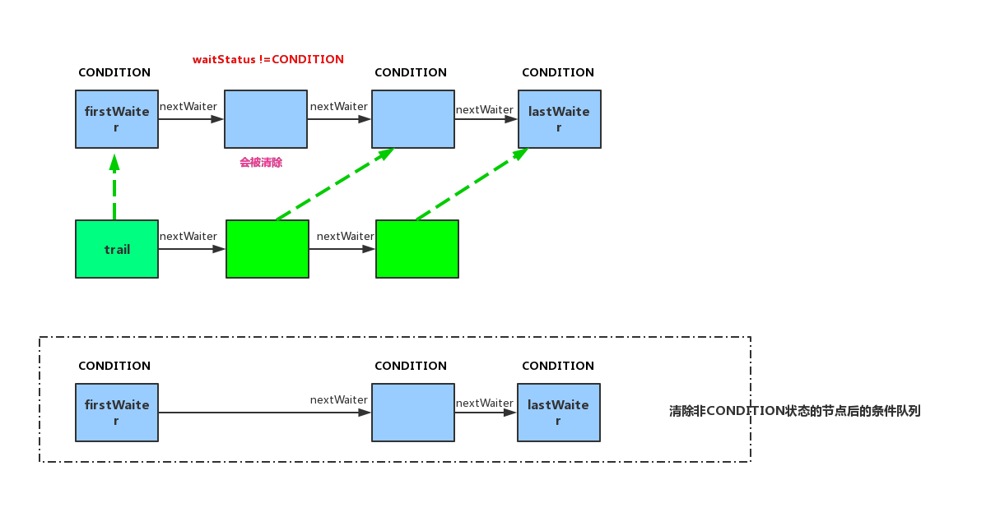

# Java并发之Condition案例

Condition 是一个接口。
Condition 接口的实现类是AQS中的内部类：java.util.concurrent.locks.AbstractQueuedSynchronizer.ConditionObject。
Lock接口中有一个java.util.concurrent.locks.Lock.newCondition方法获取Condition。
常用的实现有重入锁的实现：

```java
public Condition newCondition() {
    return sync.newCondition();
}
```

AQS的内部类ConditionObject借助内部的Node节点类实现同步与等待的：

```java
public class ConditionObject implements Condition, java.io.Serializable {
        private transient Node firstWaiter;
        private transient Node lastWaiter;
        ...
}
```


## await()方法源码解析

```java
public final void await() throws InterruptedException {
    if (Thread.interrupted())
        throw new InterruptedException();
    // 1. 清除非CONDITION状态的节点，创建一个Node节点并将其添加到条件队列的尾部
    Node node = addConditionWaiter(); 
    // 2. 释放当前节点的独占模式占用情况，并且解除后继节点的阻塞状态
    int savedState = fullyRelease(node);
    int interruptMode = 0;
    // 3. 判断是否不在同步队列中（head、tail）
    while (!isOnSyncQueue(node)) {
        // 不在同步队列中则挂起
        // 直到其他线程调用unpark、中断时才解除休眠
        LockSupport.park(this);
        // checkInterruptWhileWaiting检查是否有中断，如果在信号之前中断，返回THROW_IE;如果在信号之后中断，返回REINTERRUPT;如果没有中断，返回0。
        if ((interruptMode = checkInterruptWhileWaiting(node)) != 0)
            break;
    }
    if (acquireQueued(node, savedState) && interruptMode != THROW_IE)
        interruptMode = REINTERRUPT;
    if (node.nextWaiter != null) // clean up if cancelled
        unlinkCancelledWaiters();
    if (interruptMode != 0)
        reportInterruptAfterWait(interruptMode);
}
```


### 1. addConditionWaiter()方法创建一个代表当前线程的Node到条件队列的尾部

```java
private Node addConditionWaiter() {
    Node t = lastWaiter;
    // If lastWaiter is cancelled, clean out.
    if (t != null && t.waitStatus != Node.CONDITION) {
        // 如果节点不在条件队列中的话
        // 从条件队列中清除已取消的节点的链接
        unlinkCancelledWaiters();
        t = lastWaiter;
    }
    // 创建一个hold住当前线程的Node节点
    Node node = new Node(Thread.currentThread(), Node.CONDITION);
    if (t == null)
        firstWaiter = node;
    else
        t.nextWaiter = node;
    lastWaiter = node;
    return node;
}
```

### 1.1 清除条件队列中已取消的节点的链接

```java
private void unlinkCancelledWaiters() {
    Node t = firstWaiter;
    Node trail = null;
    while (t != null) {
        // 遍历条件队列
        Node next = t.nextWaiter; // 当前遍历的节点的后继节点
        if (t.waitStatus != Node.CONDITION) {
            // 如果当前遍历的节点不是CONDITION的话
            // 则将其后继节点置为null，意思是当前节点要被清除
            t.nextWaiter = null;
            
            if (trail == null)
                // 如果前面遍历过的节点为null，则firstWaiter指向下一个节点
                firstWaiter = next;
            else
                // 如果前面遍历过的节点不为null，则将上一次被遍历过的节点的后继指向当前被遍历的节点的后继节点。
                trail.nextWaiter = next;
            if (next == null)
                // 条件队列的尾部指向遍历轨迹的trail
                lastWaiter = trail;
        }
        else
            trail = t; // 记录刚刚遍历过的节点,第一次则记录的是 firstWaiter
        t = next; // 指向下一个节点
    }
}
```




### 2 fullyRelease(Node node)

使用当前状态值调用release;返回保存的状态;在失败时取消节点并且抛出异常。

```java
final int fullyRelease(Node node) {
    boolean failed = true;
    try {
        int savedState = getState();
        if (release(savedState)) {
            failed = false;
            return savedState;
        } else {
            throw new IllegalMonitorStateException();
        }
    } finally {
        if (failed) // 失败则取消节点
            node.waitStatus = Node.CANCELLED;
    }
}

public final boolean release(int arg) {
    if (tryRelease(arg)) {
        // 释放成功则返回true
        Node h = head;
        if (h != null && h.waitStatus != 0)
            // 并且解除后继的阻塞状态
            unparkSuccessor(h);
        return true;
    }
    return false;
}
```

### 2.1 ReentrantLock.Sync#tryRelease 方法

```java
protected final boolean tryRelease(int releases) {
    int c = getState() - releases;
    if (Thread.currentThread() != getExclusiveOwnerThread())
        throw new IllegalMonitorStateException();
    boolean free = false;
    if (c == 0) {
        // 释放独占模式线程
        free = true;
        setExclusiveOwnerThread(null);
    }
    setState(c);
    return free;
}
```

### 2.2 AbstractQueuedSynchronizer.unparkSuccessor解除后继

```java
private void unparkSuccessor(Node node) {
    
    int ws = node.waitStatus;
    if (ws < 0)
        // 如果为负数即为 SIGNAL、CONDITION、PROPAGATE 的话，置为0
        compareAndSetWaitStatus(node, ws, 0);

    
    Node s = node.next;
    if (s == null || s.waitStatus > 0) {
        // next为null或者已经被取消了
        s = null;
        for (Node t = tail; t != null && t != node; t = t.prev)
            // 从后往前遍历，找到最前面的一个等待状态不是取消CANCELED状态的节点
            if (t.waitStatus <= 0)
                s = t;
    }
    if (s != null)
        // 直接解除限制
        LockSupport.unpark(s.thread);
}

//如果线程在park上被阻塞，那么它将解阻塞。否则，它下次调用park时，保证不会阻塞。
public static void unpark(Thread thread) {
    if (thread != null)
        UNSAFE.unpark(thread);
}
```


### 3 判断是否在同步队列中

```java
final boolean isOnSyncQueue(Node node) {
    if (node.waitStatus == Node.CONDITION || node.prev == null)
        return false;
    if (node.next != null) // 如果存在后继则肯定在同步队列中
        return true;
    /*
     * node.prev can be non-null, but not yet on queue because
     * the CAS to place it on queue can fail. So we have to
     * traverse from tail to make sure it actually made it.  It
     * will always be near the tail in calls to this method, and
     * unless the CAS failed (which is unlikely), it will be
     * there, so we hardly ever traverse much.
     */
    // node.prev 可以是非空的，但是因为CAS可能会失败所以还没有在队列中。
    // 所以需要从tail开始遍历确保真实这样做的。
    // 调用这个方法时，总是在tail附近，除非CAS失败了（不太可能），所以很少会遍历
    return findNodeFromTail(node);
}


// 遍历，在同步队列中则返回true
private boolean findNodeFromTail(Node node) {
    Node t = tail;
    for (;;) {
        if (t == node)
            return true;
        if (t == null)
            return false;
        t = t.prev;
    }
}
```


## signal()方法源码解析

signal方法会通知头节点（在队列中等待最久了）。

```java
public final void signal() {
    // 检查独占模式下占有的线程是否为当前线程
    if (!isHeldExclusively())
        throw new IllegalMonitorStateException();
    
    // 目标节点设置为等待队列中的头节点
    Node first = firstWaiter;
    if (first != null)
        // 删除和传输节点，直到到达一个不可删除的节点或者null
        doSignal(first);
}

private void doSignal(Node first) {
    do {
        // 1. 如果当前被通知信号的节点（等待队列中的头节点）的下一个节点为null的话，则尾节点置为null
        if ( (firstWaiter = first.nextWaiter) == null)
            lastWaiter = null;
        
        // 2. 当前被通知信号的节点的下一个节点置为null
        first.nextWaiter = null;
    } while (!transferForSignal(first) &&
             (first = firstWaiter) != null);
}

// 从条件队列传输一个节点到同步队列，成功则返回true
final boolean transferForSignal(Node node) {
    // 如果无法变更waitStatus，说明节点已经被取消了
    if (!compareAndSetWaitStatus(node, Node.CONDITION, 0))
        return false;
    
    // 将firstWaiter入队列，并且置为tail的后继
    Node p = enq(node);
    int ws = p.waitStatus;
    if (ws > 0 || !compareAndSetWaitStatus(p, ws, Node.SIGNAL))
        // 将tail置为Node.SIGNAL，并解除其后继即firstWaiter的阻塞状态
        LockSupport.unpark(node.thread);
    return true;
}

// 将节点入队列，必要时初始化
// head、tail 是同步队列的首尾节点
private Node enq(final Node node) {
    for (;;) {
        // 死循环处理
        Node t = tail;
        if (t == null) { // Must initialize
            if (compareAndSetHead(new Node())) // tail为null，则表示同步队列是空的，初始化head节点
                tail = head; // 并且tail设置和head一样
        } else {
            // 将firstWaiter的前置节点指向tail
            node.prev = t;
            if (compareAndSetTail(t, node)) {
                // 将tial的后置指向firstWaiter并返回tail节点
                t.next = node;
                return t;
            }
        }
    }
}

// 硬件级别的原子控制； headOffset表示head头的内存中的偏移位置
// 4各参数：对象、偏移位置、期望值、目标修改值
private final boolean compareAndSetHead(Node update) {
    return unsafe.compareAndSwapObject(this, headOffset, null, update);
}

private final boolean compareAndSetTail(Node expect, Node update) {
    return unsafe.compareAndSwapObject(this, tailOffset, expect, update);
}
```


## AQS的Node节点的waitStatus等待状态属性说明

waitStatus存在以下几个int类型值：

- **CANCELLED** : 1; 
    - 该节点由于超时或者中断而被取消。节点永远不会离开此状态。特别是，具有已取消节点的线程再也不会阻塞。
- **SIGNAL** : -1; 
    - 该节点的后继（或者将）被阻塞（通过park），所以该节点在释放或者取消时必须解除其后继。为了避免竞争，acquire方法首先表明他们需要一个信号，然后重试原子性的acquire，如果失败会block。
- **CONDITION** : -2;
    - 该节点现在在一个条件队列中。直到被传输之前它都不会被用作同步队列的节点，此时他的状态会被设置为0。这里这个值的使用与其它使用这个字段的场景无关，但是简化了机制。
- **PROPAGATE** : -3;

- **0值** ： 0; 上述几种情况之外。

**非负值表示节点不需要发出信号。初始为0可以用作同步节点，CONDITION用于条件节点，使用CAS来对值进行修改。**

## Condition案例--生产者、消费者

[Condition案例--生产者、消费者示例程序](../../src/main/java/org/byron4j/fuckjavathreadconcurrency/curr/waitnotifypattern/ConditionTest.java)


- [WaitNotify案例](../../src/main/java/org/byron4j/fuckjavathreadconcurrency/curr/waitnotifypattern/WaitNotifyTest.java)